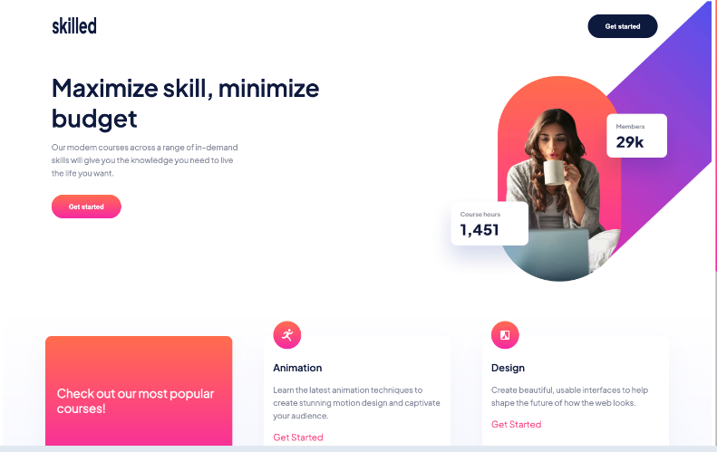

# Frontend Mentor - Skilled e-learning landing page solution

This is a solution to the [Skilled e-learning landing page challenge on Frontend Mentor](https://www.frontendmentor.io/challenges/skilled-elearning-landing-page-S1ObDrZ8q). Frontend Mentor challenges help you improve your coding skills by building realistic projects.

## Table of contents

- [Overview](#overview)
  - [Screenshot](#screenshot)
  - [Links](#links)
  - [Built with](#built-with)
  - [What I learned](#what-i-learned)
  - [Continued development](#continued-development)
  - [Useful resources](#useful-resources)
- [Author](#author)

## Overview

An HTML and CSS landing page for Skilled e-learning.

### Screenshot

### Links

- Solution URL: https://www.frontendmentor.io/solutions/skilled-elearning-landing-page-using-html-and-sass-EDUTOytJGX
- Live Site URL: https://skilled-rho.vercel.app/
- GitHub Repo: https://github.com/ZounMedia/skilled

## My process

### Built with

- Semantic HTML5 markup
- SCSS
- Flexbox
- Mobile-first workflow

### What I learned

I learned a lot about positioning images and mobile-first development

### Continued development

I used SASS for this project and it made styling much easier to manage.

### Useful resources

- https://sass-lang.com/ - SASS documentation

## Author

- Frontend Mentor - https://www.frontendmentor.io/profile/@rzounlom
